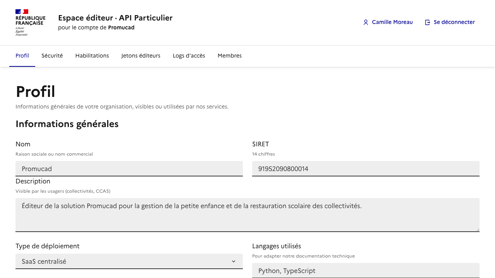

# Le nouvel espace éditeur

Ce document présente le **futur espace éditeur** : l'endroit unique où vous
piloterez votre relation à API Particulier (délégations, sécurité, jetons,
logs, membres).

---

## 1. Le contexte

L'espace éditeur actuel est **minimal** : il se limite à un **listing** des
habilitations liées à vos formulaires éditeurs. Pas de configuration, pas de
self-service, peu de visibilité.

L'objectif : en faire un véritable **cockpit**, qui matérialise tous les autres
chantiers (délégation, sécurité, traçabilité).

## 2. Aperçu



Maquette de la rubrique Profil (données fictives). La version interactive est
disponible : `mockup-espace-editeur.html`.

## 3. Les six rubriques

| Rubrique | Contenu | À quoi ça sert |
|---|---|---|
| **Profil** | Nom, SIRET, description, contact | Vos informations générales |
| **Sécurité** | IP autorisées, clé publique DPoP (consultation) | Voir votre niveau de protection |
| **Habilitations** | Habilitations qui vous sont déléguées | Savoir qui vous servez |
| **Jetons éditeurs** | Vos jetons et leur statut | Gérer vos accès |
| **Logs d'accès** | Journal des appels | Observabilité, débogage |
| **Membres** | Personnes de votre organisation ayant accès | Gérer les droits internes |

### Profil

Vos informations générales : nom, SIRET, description (visible des usagers), type
de déploiement, contact, langages utilisés. **Éditable** par vous.

### Sécurité

Vos **adresses IP autorisées** et l'**empreinte de votre clé publique DPoP**,
avec le statut de chaque protection (ex. « IP : actif », « DPoP : mode log ».
Au début, ces valeurs sont en **lecture seule** (voir §4).

### Habilitations

La liste des habilitations **qui vous sont déléguées** : numéro DataPass,
intitulé, collectivité (SIRET), statut de la délégation et `delegation_id` à
réutiliser dans vos appels.

### Jetons éditeurs

Vos jetons éditeurs : identifiant, date de création, expiration, statut
(actif / expiré), et génération d'un nouveau jeton.

### Logs d'accès

Le journal de vos appels : date, endpoint, destinataire (SIRET), `delegation_id`,
identifiant d'agent (haché) et code HTTP. Utile pour l'observabilité et le
débogage.

### Membres

Les personnes de votre organisation ayant accès à l'espace, avec ajout et
retrait. C'est ici que vous gérez **qui, chez vous**, peut voir les jetons et la
configuration.

## 4. La sécurité en lecture seule (au début)

Au démarrage, les valeurs sensibles (IP autorisées, clé publique DPoP) sont
**affichées mais pas modifiables** : pour les changer, vous passez par l'équipe.
C'est un garde-fou le temps de stabiliser le dispositif.

## 5. Trajectoire

```text
Étape 1 : ACCOMPAGNÉ   →   Étape 2 : SELF-SERVICE
opérations sensibles       configuration en autonomie
via l'équipe               (IP, clé DPoP, délégations...)
```

L'espace s'enrichit **au fil des chantiers** : chaque rubrique arrive avec la
fonctionnalité qu'elle pilote, pas tout d'un seul coup.

---

Une **maquette interactive** (les 6 onglets) est disponible :
`mockup-espace-editeur.html`, à ouvrir dans un navigateur.
